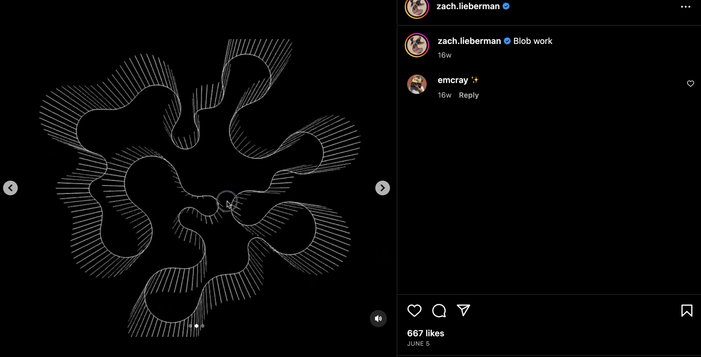
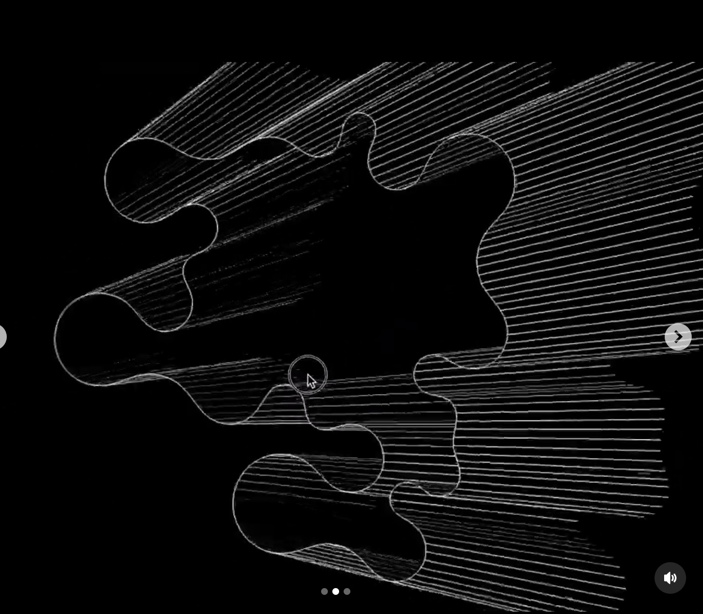
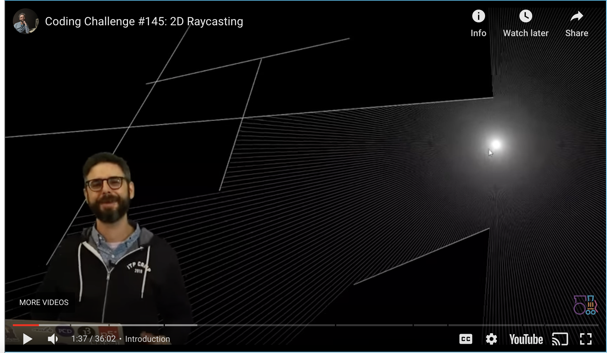

# Quiz 8
### mxhey0706_9103_tut5

## Imaging example

The example below is an artwork from a generative artist named **Zac Lieberman**. This artist uses coding techniques to create unique abstract pieces in Open Frameworks. Many of his works are animated and inspirational for the *animated section of the coding project*.

He shows a blob that flows freely with lines casting outwards, creating an exciting design. The cursor can manipulate the blob, transforming the casted lines to avoid where the cursor goes. This could inspire the animated part of my works by including a feature where the user's cursor may manipulate the artwork or spread the colours on a canvas, like rays.

## Coding technique

Raycasting can be implemented to achieve something like the example. Codingtrain has a video of how to implement 2D raycasting. 

https://www.youtube.com/watch?v=TOEi6T2mtHo 
**Raycasting** allows us to create imaginary lines to determine where a line should intersect with an object. To achieve the above example, we would determine where the lines that cast off the blob should finish if crossing the boundaries or reaching the maximum distance. The positional values and velocity of the ray and boundaries must be declared – with the rays stopping their speed once hitting the edge.

https://editor.p5js.org/codingtrain/sketches/Nqsq3DFv-

